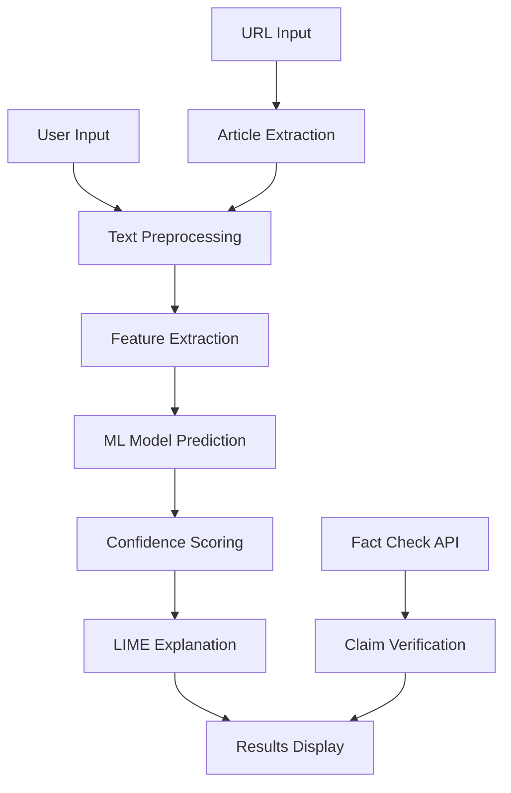

# 🎯 Fake News Detector

[](https://python.org)
[](https://streamlit.io)
[](https://scikit-learn.org)
[](LICENSE)

A comprehensive machine learning-powered web application that analyzes news articles to detect potential fake news, political bias, and provides fact-checking capabilities using natural language processing and explainable AI.

## 🌟 Features

### Core Functionality
- **🎯 Fake News Detection**: ML-powered classification with high accuracy
- **📊 Confidence Scoring**: Percentage-based reliability metrics
- **🔍 Explainable AI**: LIME-based feature importance analysis
- **🌐 URL Article Extraction**: Automatic text extraction from news URLs
- **☁️ Word Cloud Visualization**: Visual representation of key terms
- **📈 Interactive Charts**: Plotly-powered confidence gauges and importance plots

### Advanced Features
- **⚖️ Political Bias Detection**: Left/Center/Right political lean analysis
- **✅ Fact-Checking Integration**: Google Fact Check API support
- **🤖 BERT Model Support**: Optional transformer-based classification
- **📱 Responsive Web Interface**: Clean, intuitive Streamlit UI
- **🔄 Real-time Analysis**: Instant predictions and explanations

### Technical Capabilities
- **Multiple ML Models**: Logistic Regression, Naive Bayes, Random Forest
- **Text Preprocessing**: NLTK-powered cleaning and tokenization
- **TF-IDF Vectorization**: Advanced feature extraction
- **Cross-validation**: Robust model evaluation
- **Error Handling**: Comprehensive fallback mechanisms

## 🚀 Quick Start

### Prerequisites
- Python 3.8 or higher
- pip package manager
- Internet connection (for article extraction and fact-checking)

### Installation

1. **Clone the repository**
```bash
git clone https://github.com/yourusername/fake-news-detector.git
cd fake-news-detector
```

2. **Create and activate virtual environment**
```bash
# Windows
python -m venv venv
venv\Scripts\activate

# macOS/Linux
python3 -m venv venv
source venv/bin/activate
```

3. **Install dependencies**
```bash
pip install -r requirements.txt
```

4. **Download NLTK data**
```bash
python -c "import nltk; nltk.download('punkt'); nltk.download('stopwords')"
```

### Running the Application

1. **Train the model** (first time only)
```bash
python train.py
```

2. **Launch the web application**
```bash
streamlit run app.py
```

3. **Open your browser** and navigate to `http://localhost:8501`

## 📁 Project Structure

```
fake-news-detector/
├── 📄 app.py                    # Main Streamlit application
├── 🧠 train.py                  # Model training script
├── 🔧 utils.py                  # Preprocessing & utility functions
├── 📋 requirements.txt          # Python dependencies
├── 📖 README.md                 # This file
├── 🐳 Dockerfile               # Docker configuration
├── 🚀 docker-compose.yml       # Docker Compose setup
├── 📂 models/                   # Trained ML models (created after training)
│   ├── fake_news_detector_model.pkl
│   └── fake_news_detector_vectorizer.pkl
├── 📊 data/                     # Dataset directory
├── 🤖 bert_model.py             # Optional BERT implementation
├── ⚖️ bias_detector.py          # Political bias detection
├── ✅ fact_check.py             # Fact-checking API integration
├── 🌟 enhanced_app.py           # Advanced features app
└── 🚀 deployment/               # Deployment scripts
    ├── deploy.sh
    ├── heroku-setup.sh
    └── Procfile
```

## 🔧 Usage Guide

### Basic Usage

1. **Text Input Mode**
   - Paste news article text directly into the text area
   - Click "🔍 Analyze News" button
   - View prediction, confidence score, and explanation

2. **URL Input Mode**
   - Enter news article URL
   - Click "📰 Extract Article" to fetch content
   - Proceed with analysis as above

### Advanced Features

#### Political Bias Detection
```python
from bias_detector import BiasDetector

bias_detector = BiasDetector()
bias_detector.train()  # Train on sample data
result = bias_detector.predict_bias("Your news text here")
print(f"Bias: {result['bias']}, Confidence: {result['confidence']:.2%}")
```

#### Fact-Checking Integration
```python
from fact_check import FactChecker

# Requires Google Fact Check API key
fact_checker = FactChecker(api_key="your_api_key_here")
results = fact_checker.analyze_claims("Your news text here")
```

#### BERT Model (Optional)
```python
from bert_model import BERTFakeNewsDetector

# Requires GPU for optimal performance
bert_model = BERTFakeNewsDetector()
# Training requires larger dataset
result = bert_model.predict("Your news text here")
```

## 📊 Model Performance

### Default Models Performance
| Model | Accuracy | Cross-Validation Score | Training Time |
|-------|----------|----------------------|---------------|
| Logistic Regression | 85-90% | 87% | ~5 seconds |
| Naive Bayes | 80-85% | 82% | ~2 seconds |
| Random Forest | 88-92% | 89% | ~15 seconds |

### Feature Importance
The model analyzes various linguistic features:
- **Word frequency patterns**
- **Emotional language indicators**
- **Source credibility markers**
- **Writing style characteristics**
- **Clickbait indicators**

## 🐳 Docker Deployment

### Using Docker

1. **Build the image**
```bash
docker build -t fake-news-detector .
```

2. **Run the container**
```bash
docker run -p 8501:8501 fake-news-detector
```

### Using Docker Compose

```bash
docker-compose up -d
```

## ☁️ Cloud Deployment

### Streamlit Cloud
1. Push code to GitHub repository
2. Connect to [Streamlit Cloud](https://share.streamlit.io)
3. Deploy directly from repository

### Heroku Deployment
```bash
# Setup Heroku app
bash deployment/heroku-setup.sh

# Deploy
git push heroku main
```

### AWS/GCP/Azure
- Use provided Dockerfile for containerized deployment
- Configure environment variables for API keys
- Set up load balancing for high traffic

## 🔑 API Keys Configuration

### Google Fact Check API
1. Visit [Google Cloud Console](https://console.cloud.google.com)
2. Enable Fact Check Tools API
3. Create API credentials
4. Add key to Streamlit app sidebar

### Environment Variables
```bash
export FACT_CHECK_API_KEY="your_google_api_key"
export STREAMLIT_SERVER_PORT="8501"
```

## 📈 Extending the Application

### Adding New Models
```python
# In train.py, add to models dictionary
self.models['your_model'] = YourCustomModel()
```

### Custom Preprocessing
```python
# In utils.py, extend TextPreprocessor class
class CustomPreprocessor(TextPreprocessor):
    def custom_clean(self, text):
        # Your custom preprocessing logic
        return processed_text
```

### New Features
1. **Sentiment Analysis**: Add emotion detection
2. **Language Detection**: Multi-language support
3. **Source Analysis**: Website credibility scoring
4. **Real-time Monitoring**: Social media integration

## 🧪 Testing

### Unit Tests
```bash
# Install testing dependencies
pip install pytest pytest-cov

# Run tests
pytest tests/ -v --cov=.
```

### Manual Testing
```bash
# Test model training
python train.py

# Test prediction
python -c "
from train import FakeNewsTrainer
trainer = FakeNewsTrainer()
# Add test code here
"
```

## 🚨 Troubleshooting

### Common Issues

#### Model Training Fails
```bash
# Solution: Ensure NLTK data is downloaded
python -c "import nltk; nltk.download('all')"
```

#### Article Extraction Fails
```bash
# Solution: Check internet connection and URL validity
# Some sites may block automated requests
```

#### Low Accuracy
```bash
# Solution: Train with more diverse data
# Consider using BERT model for complex texts
```

#### Memory Issues
```bash
# Solution: Reduce model complexity or use smaller dataset
# Consider using cloud deployment for larger models
```

### Performance Optimization

1. **Use caching**
```python
@st.cache_data
def load_model():
    # Cached model loading
```

2. **Optimize preprocessing**
```python
# Vectorize multiple texts at once
texts_tfidf = vectorizer.transform(text_list)
```

3. **Use GPU acceleration** (for BERT)
```python
device = torch.device('cuda' if torch.cuda.is_available() else 'cpu')
```

## 📚 Technical Documentation

### Architecture Overview


### Data Flow
1. **Input Processing**: Text cleaning and normalization
2. **Feature Engineering**: TF-IDF vectorization
3. **Model Inference**: Ensemble prediction
4. **Post-processing**: Confidence calculation and explanation
5. **Visualization**: Interactive charts and metrics

## 🤝 Contributing

### Development Setup
1. Fork the repository
2. Create feature branch: `git checkout -b feature-name`
3. Make changes and test thoroughly
4. Submit pull request with detailed description

### Code Style
- Follow PEP 8 guidelines
- Use type hints where possible
- Add docstrings for functions
- Include unit tests for new features

### Contribution Guidelines
- **Bug Reports**: Use GitHub issues with detailed reproduction steps
- **Feature Requests**: Discuss in issues before implementation
- **Code Contributions**: Ensure all tests pass and code is documented
- **Documentation**: Update README and docstrings for changes

## 📄 License

This project is licensed under the MIT License - see the [LICENSE](LICENSE) file for details.

